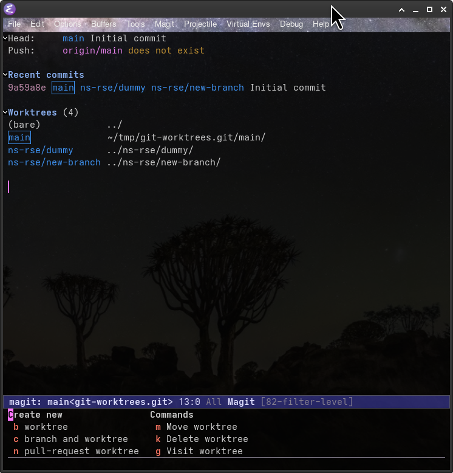

## Scan This



[ns-rse.github.io/git-worktrees](https://ns-rse.github.io/git-worktrees)

## Git Worktrees

- What?
- Why?
- Challenges?

## What are Worktrees?

- Single clone of a repository.
- Branches live in their own directory.
- `cd to/worktree` and you check it out.


## No Worktrees

```shell
❱ cd ~/work/git/hub/ns-rse/
❱ git clone git@github.com:ns-rse/git-worktrees.git
❱ cd git-worktrees
❱ ls -lha
drwxr-xr-x neil neil 4.0 KB Fri May  1 09:09:16 2026  .
drwxr-xr-x neil neil 4.0 KB Fri May  1 09:07:36 2026  ..
drwxr-xr-x neil neil 4.0 KB Fri May  1 09:19:27 2026  .git    # <<<< configuration directory
drwxr-xr-x neil neil 4.0 KB Fri May  1 09:07:38 2026  .github
.rw-r--r-- neil neil  49 B  Fri May  1 09:07:38 2026  .gitignore
.rw-r--r-- neil neil 310 B  Fri May  1 09:07:38 2026  .markdownlint-cli2.yaml
.rw-r--r-- neil neil 567 B  Fri May  1 09:07:38 2026  .pre-commit-config.yaml
.rw-r--r-- neil neil  26 B  Fri May  1 09:07:38 2026  .Rprofile
.rw-r--r-- neil neil 158 B  Fri May  1 09:07:38 2026  _quarto.yml
drwxr-xr-x neil neil 4.0 KB Fri May  1 09:07:38 2026  img
.rw-r--r-- neil neil 7.9 KB Fri May  1 09:07:38 2026  index.qmd
.rw-r--r-- neil neil 6.9 KB Fri May  1 09:07:38 2026  LICENSE
.rw-r--r-- neil neil 7.7 KB Fri May  1 09:07:38 2026  README.md
drwxr-xr-x neil neil 4.0 KB Fri May  1 09:14:19 2026  renv
.rw-r--r-- neil neil  15 KB Fri May  1 09:07:38 2026  renv.lock
.rw-r--r-- neil neil  24 B  Fri May  1 09:07:38 2026 󰌠 requirements.txt
```

## Worktrees

```shell
❱ git clone --bare git@github.com:ns-rse/git-worktrees.git git-worktrees
❱ cd git-worktrees
❱ ls -lha
drwxr-xr-x neil neil 4.0 KB Fri May  1 09:21:32 2026  .
drwxr-xr-x neil neil  12 KB Fri May  1 09:21:25 2026  ..
.rw-r--r-- neil neil 131 B  Fri May  1 09:21:32 2026  config
.rw-r--r-- neil neil  73 B  Fri May  1 09:21:25 2026  description
.rw-r--r-- neil neil  21 B  Fri May  1 09:21:32 2026  HEAD
drwxr-xr-x neil neil 4.0 KB Fri May  1 09:21:25 2026  hooks
drwxr-xr-x neil neil 4.0 KB Fri May  1 09:21:25 2026  info
drwxr-xr-x neil neil 4.0 KB Fri May  1 09:21:25 2026  objects
.rw-r--r-- neil neil 103 B  Fri May  1 09:21:32 2026  packed-refs
drwxr-xr-x neil neil 4.0 KB Fri May  1 09:21:32 2026  refs
```

::: {.notes}
Normally when you clone a repository you get all the files in the initial clone. You can use worktrees from such a setup
but a common strategy for using worktrees is to clone a bare repository. In such a case the directory contains all of
the configuration files that normally reside within the ~.git/~ directory of a cloned repository.
:::

## Creating Worktrees

- Typically want a copy of `main`.
- `git worktree add` takes two main arguments, the `branch` and the `path`.

```shell
❱ git worktree add main main
```

- Create `ns-rse/new-branch` branch in `ns-rse/new-branch/` directory

```
❱ git worktree add -b ns-rse/new-branch ns-rse/new-branch
```

- Directories can be _anywhere_!

```
❱ git worktree add -b ns-rse/new-branch ~/a/completely/different/directory/ns-rse/new-branch

```

- Fetch remote branches first

```
❱ git fetch origin ns-rse/dummy:ns-rse/dummy
❱ git worktree add ns-rse/dummy ns-rse/dummy
```

## Two Worktrees

Within `ns-rse/`

``` shell
❱ tree ns-rse
[4.0K May  1 09:44]  ns-rse
├── [4.0K May  1 09:44]  ns-rse/dummy
│   ├── [4.0K May  1 09:44]  ns-rse/dummy/img
│   │   └── [ 34K May  1 09:44]  ns-rse/dummy/img/OSC_Sheffield.png
│   ├── [7.9K May  1 09:44]  ns-rse/dummy/index.qmd
│   ├── [6.9K May  1 09:44]  ns-rse/dummy/LICENSE
│   ├── [ 158 May  1 09:44]  ns-rse/dummy/_quarto.yml
│   ├── [7.7K May  1 09:44]  ns-rse/dummy/README.md
│   ├── [4.0K May  1 09:44]  ns-rse/dummy/renv
│   │   ├── [ 32K May  1 09:44]  ns-rse/dummy/renv/activate.R
│   │   └── [ 412 May  1 09:44]  ns-rse/dummy/renv/settings.json
│   ├── [ 15K May  1 09:44]  ns-rse/dummy/renv.lock
│   └── [  24 May  1 09:44]  ns-rse/dummy/requirements.txt
└── [4.0K May  1 09:40]  ns-rse/new-branch
    ├── [4.0K May  1 09:40]  ns-rse/new-branch/img
    │   └── [ 34K May  1 09:40]  ns-rse/new-branch/img/OSC_Sheffield.png
    ├── [7.9K May  1 09:40]  ns-rse/new-branch/index.qmd
    ├── [6.9K May  1 09:40]  ns-rse/new-branch/LICENSE
    ├── [ 158 May  1 09:40]  ns-rse/new-branch/_quarto.yml
    ├── [7.7K May  1 09:40]  ns-rse/new-branch/README.md
    ├── [4.0K May  1 09:40]  ns-rse/new-branch/renv
    │   ├── [ 32K May  1 09:40]  ns-rse/new-branch/renv/activate.R
    │   └── [ 412 May  1 09:40]  ns-rse/new-branch/renv/settings.json
    ├── [ 15K May  1 09:40]  ns-rse/new-branch/renv.lock
    └── [  24 May  1 09:40]  ns-rse/new-branch/requirements.txt

7 directories, 18 files
```

## Switching ~branches~ worktrees

:::: {.columns}

::: {.column width="50%"}

**No Worktrees**

```
❱ cd ns-rse/dummy
❱ git status
On branch ns-rse/dummy
nothing to commit, working tree clean
```

:::

::: {.column width="50%"}

**Worktrees**

```
❱ cd ns-rse/dummy
❱ git status
On branch ns-rse/new-branch
nothing to commit, working tree clean
```

:::
::::

- ✅ Different branches can have their own virtual environment with different dependencies.
- ✅ No need to `git stash` work in progress to checkout another branch.
- ✅ Switching branches is as simple as `cd`-ing into the directory.


::: {.notes}
Switching branches is as simple as `cd`-ing into the directory.
:::


## Challenges

- Need to create virtual environment in each directory.
- Large dependencies will increase required space.
- No `pre-commit` installed in worktree
- No [`.justfile`](https://just.systems/man/en/)

## Solutions!

- Bloated directories requires discipline to remove old worktree directory.
  - Not more onerous than removing old branches.
- Use a `post-checkout` hook to setup virtual environment, pre-commit and just! 🪄
  - Uses...
    - [`direnv`](https://direnv.net/)
    - [`just`](https://just.systems/man/en/)
    - [`pre-commit`](https://pre-commit.com)
    - [`uv`](https://docs.astral.sh/uv)
  - Assumes using nested `<github-user>/<branch-name>` structure for worktree directories (modify `BASE_PATH` if needed).


## Post-checkout hook

[Inspiration](https://mskelton.dev/bytes/20230906143340)

Find in my [dotfiles](https://codeberg.org/slackline/dotfiles/src/branch/master/.config/git/hooks/post-checkout).

```bash
#!/bin/bash
#
# Inspiration from : https://mskelton.dev/bytes/20230906143340
#
# Copy .justfile and .envrc to new worktrees on first checkout and create and activate a virtual environment
# with uv

# Base directory for bare repository
BASE_PATH="$(git rev-parse --git-dir)/../../"

if [ ! -f "${BASE_PATH}/main/.justfile" ]; then
  echo "No .justfile creating a basic skeleton"
  echo "@default:\n    @just --list\n\n" > main/.justfile
  echo "mkdocs:\n    mkdocs serve --watch docs" >> main/.justfile
  echo "test_profile:\n    python -m cProfile -o tmp/$(git rev-parse HEAD)_$(date +%Y%m%d).prof $(which pytest) tests/test.py"
  echo "test:\n    pytest --cov=src --numprocesses=logical"
  echo "pc_ruff\n    pre-commit run ruff-check --all-files ; pre-commit run ruff-format --all-files"
  echo "pc_npd:\n    pre-commit run numpydoc-validation --all-files"
  echo "pc_black:\n    pre-commit run blacken-docs --all-files"
  echo "pc_prettier:\n    pre-commit run prettier --all-files"
  echo "pc_markdown:\n    pre-commit run markdownlint-cli2 --all-files"
  echo "pc_pylint:\n    pre-commit run pylint --all-files"
fi

if [ ! -f "${BASE_PATH}/main/.envrc" ]; then
  echo "No .envrc creating a basic skeleton"
  echo "#!/bin/bash\nsource .venv/bin/activate" > main/.envrc
fi

if [[ "$1" == "0000000000000000000000000000000000000000" ]]; then
  # Copy files (they should be in main/)
  FILES=(".justfile" ".envrc")

  for FILE in "${FILES[@]}"; do
    echo "Copying main/'${FILE}' to $(pwd)/${FILE}"
	cp "${BASE_PATH}/main/${FILE}" "$(pwd)/${FILE}"
  done

  # Create a virtual environment using uv and install
  if [ ! -d ".venv/" ]; then
    uv venv
    uv sync
    uv pip install -e .
    # Allow direnv so venv can be activated
    direnv allow
  fi
  # Install pre-commit if not already in place
  if [ ! -f "${BASE_PATH}/hooks/pre-commit" ]; then
    $(which pre-commit) install
  fi
```

## Emacs/Magit Integration

- ✅ [Magit](https://magit.vc), the Git porcelain for [Emacs](https://www.gnu.org/software/emacs/), supports worktrees.
- ✅ List worktrees in the Magit buffer, easy to switch (cursor on point hit `Return`)
- ✅ `Z` pulls up the transient buffer for worktree management.
- ✅ Still use [Forge](https://docs.magit.vc/forge/) to interact with and create issues/pull requests GitHub/GitLab.

``` lisp
  ;; https://huonw.github.io/blog/2025/12/magit-insert-worktrees/
  ;; Show all worktrees at the end of the status buffer (if more than one)
  (add-hook 'magit-status-sections-hook #'magit-insert-worktrees t)
```



##

](https://wizardzines.com/images/uploads/git-worktree.png)

## Links

- [Practical Guide to Git Worktree - DEV Community](https://dev.to/yankee/practical-guide-to-git-worktree-58o0)
- [Git Worktrees in Use. Most of us use Git every day, but…](https://medium.com/ngconf/git-worktrees-in-use-f4e516512feb) << This seems good, clearest so far.
- [Git - git-worktree Documentation](https://git-scm.com/docs/git-worktree)
- [Git Worktrees: Git Done Right - Just Some Dev](https://www.nickyt.co/blog/git-worktrees-git-done-right-2p7f/)
- [Improving my productivity and context switching with git worktrees](https://futurepixels.co.uk/posts/improving-my-productivity-and-context-switching-with-git-worktrees/)
- [GitKraken - How to Use Git Worktree | Add, List, Remove](https://www.gitkraken.com/learn/git/git-worktree)

### Hooks

- [Using Git Hooks When Creating Worktrees | Mark Skelton](https://mskelton.dev/bytes/20230906143340)
- [githooks - Using Git hooks with worktree - Stack Overflow](https://stackoverflow.com/questions/79186993/using-git-hooks-with-worktree)

### Tools

- [abtris/worktree-util: Simple utility for working with git worktree](https://github.com/abtris/worktree-util)
